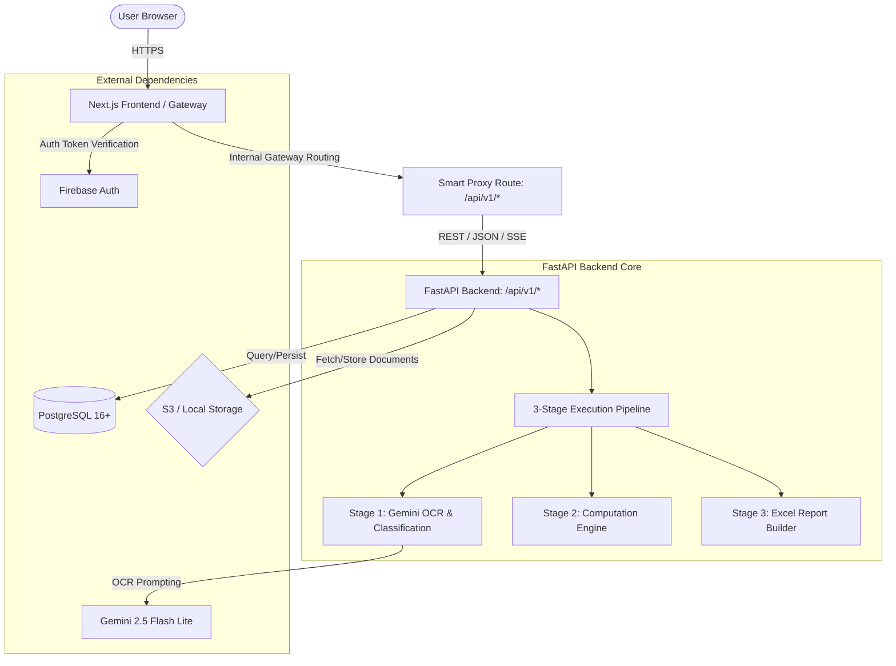
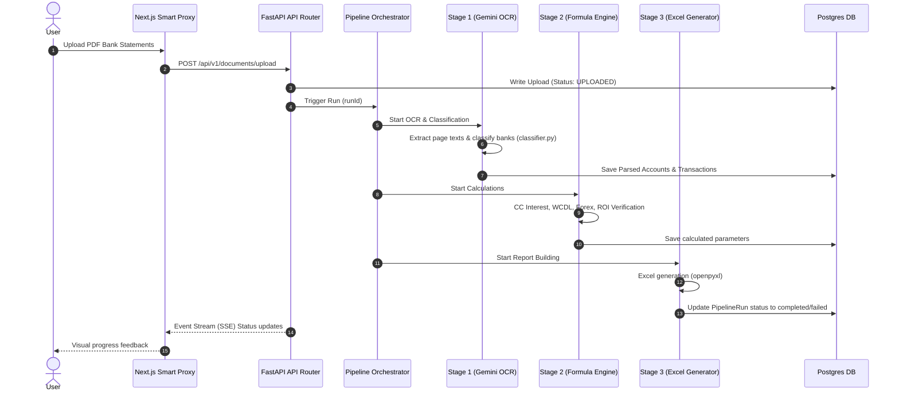

# Vyrenzo Bank — Architecture Documentation

Vyrenzo Bank is an AI-powered banking intelligence platform engineered to automate the extraction, computation, verification, and reconciliation of complex banking data. The system is designed as a modular Monorepo containing a Next.js 16 frontend and a FastAPI Python backend.

---

## 🏗️ System Overview

The system architecture utilizes a **Next.js frontend** that serves both the UI and acts as a gateway proxy to a **FastAPI backend**. The database layer is powered by **PostgreSQL 16+**, with files stored in **AWS S3** (or a local directory during development).

---

## 📦 Directory Structure & Component Layout

The monorepo splits concerns between the frontend user experience and the backend computation and data processing pipeline.

*   **[frontend/](file:///d:/Vyrenzo%20Fintool%20June/vyrenzo-proj1-fincore/frontend)**: Contains the React UI and API proxy routes.
*   **[backend/](file:///d:/Vyrenzo%20Fintool%20June/vyrenzo-proj1-fincore/backend)**: Contains the FastAPI server, database scripts, OCR classifiers, and computation formulas.

---

## 🖥️ Frontend Architecture (Next.js 16)

The frontend is a modern Next.js 16 application leveraging React components and Tailwind CSS for styling.

### 🌐 Smart Proxy Gateway
Rather than pointing client-side fetch requests directly to the FastAPI server (which could lead to CORS complications, SSL trust issues in local networks, or API key exposures), the frontend implements a **Universal API Proxy Route** at:
*   [route.ts](file:///d:/Vyrenzo%20Fintool%20June/vyrenzo-proj1-fincore/frontend/app/api/%5B...path%5D/route.ts)

**Key responsibilities of the Proxy Route:**
1.  **CamelCase to snake_case Parsing**: Bridges the gap between frontend camelCase conventions and backend Pythonic snake_case expectations.
2.  **Long-Running Job Tolerances**: Configured with a `maxDuration = 300` (up to 300 seconds on Vercel Pro) to prevent timeouts during backend heavy-computation stages.
3.  **Dynamic URL Resolution**: Automatically maps calls depending on environment variables (`NEXT_PUBLIC_BACKEND_URL`, `BACKEND_URL`, or Vercel deployment variables).
4.  **Security**: Forwards authorization headers (Firebase ID tokens) securely to the backend for identity verification.

---

## ⚙️ Backend Architecture (FastAPI)

The backend is built with FastAPI and runs on Python 3.13+. It processes financial files through a strict, linear pipeline.

### 1. 📋 The 3-Stage Pipeline
The heart of the computational backend is a graph-like sequential processing framework:

*   **Stage 1: OCR, Bank Classification & Extraction**
    *   Reads uploaded PDF statement binary files.
    *   Uses Regex Classifiers ([classifier.py](file:///d:/Vyrenzo%20Fintool%20June/vyrenzo-proj1-fincore/backend/app/ocr/classifier.py)) to map the statement layout to a specific bank structure.
    *   Applies **Gemini 2.5 Flash Lite** prompts to intelligently execute OCR and map transactions into standard models (Date, Narration, Withdrawals, Deposits, and Balances).
*   **Stage 2: Financial Computation Engine**
    *   Executes localized, zero-dependency financial algorithms found in the `backend/app/computation/` module.
    *   Reconciles:
        *   **CC (Cash Credit) Interest**: Computes interest on daily outstanding balances and cross-checks them against bank-charged interest.
        *   **WCDL (Working Capital Demand Loan) Interest**: Validates WCDL disbursements, repayments, interest rates, and maturity deadlines.
        *   **Forex Average Rates**: Tracks foreign currency transactions against average and market rates.
        *   **ROI Deviation**: Flag discrepancies where the bank rate departs from the agreed rate.
*   **Stage 3: Report Compilation**
    *   Generates multi-sheet Excel files mapping the raw transactions, calculations, deviations, and summary dashboards.
    *   Saves the resulting spreadsheets to S3 or local disk.

---

## 🗄️ Database & Storage Layer

*   **Relational Schema (PostgreSQL)**: Handles transactional persistence, audit trails, roles, configurations, and conversation logs for the AI chat agent. See [Database.md](file:///d:/Vyrenzo%20Fintool%20June/vyrenzo-proj1-fincore/docs/Database.md) for full layout.
*   **Object Storage (Local / S3)**: Abstracted via the `USE_LOCAL_STORAGE` flag. When set to `false`, it utilizes AWS S3 SDK (`boto3`) to upload raw PDF statements and generated Excel worksheets.
