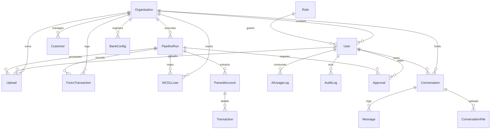

# Vyrenzo Bank — Database Documentation

Vyrenzo Bank uses a **PostgreSQL 16+** relational database. The schema is optimized for Firebase Google Auth, multi-tenancy (via `orgId`), role-based access control, file tracking, audit trails, and financial intelligence persistence.

The source schema file is located at [schema.sql](file:///d:/Vyrenzo%20Fintool%20June/vyrenzo-proj1-fincore/backend/database/schema.sql).

---

## 🗄️ Database Setup & Installation

### 1. Create local database
Connect to your PostgreSQL host via CLI (`psql`) or tool (PGAdmin, DBeaver) and create the development database:
```sql
CREATE DATABASE fincore_dev;
```

### 2. Run schema.sql
Execute the SQL schema definition:
```powershell
cd backend
psql -U postgres -d fincore_dev -f database/schema.sql
```
*(Default password is `Bharadwaj2112` unless modified locally)*

---

## 🏗️ Entity Relationship Diagram (Abstract)



---

## 📋 Schema Reference

### 1. Authentication & RBAC

#### 🔑 Table: `Role`
Defines roles and page level visibility configurations (RBAC).
*   `id`: `SERIAL PRIMARY KEY`
    *   `0`: `SUPER_ADMIN`
    *   `1`: `ADMIN`
    *   `2`: `ANALYST`
    *   `3`: `VIEWER`
    *   `4`: `PENDING_APPROVAL`
*   `name`: `TEXT UNIQUE NOT NULL` (e.g. `ANALYST`, `ADMIN`)
*   `description`: `TEXT`
*   `allowedPages`: `TEXT[] DEFAULT '{"*"}'` (Allows granular access control on pages like `"Dashboard"`, `"Upload"`, `"WCDL Tracker"`, etc.)

#### 🏢 Table: `Organisation`
Supports multi-tenancy.
*   `id`: `TEXT PRIMARY KEY` (Default: `default-org`)
*   `name`: `TEXT NOT NULL` (e.g. `Vyrenzo Bank Demo`)
*   `legalName`: `TEXT`
*   `address`: `TEXT`
*   `logoUrl`: `TEXT`
*   `departments`: `TEXT[] DEFAULT '{}'`
*   `createdAt`: `TIMESTAMPTZ`

#### 👤 Table: `User`
Tracks users, associated organization, role, and Firebase metadata.
*   `id`: `TEXT PRIMARY KEY` (Firebase UID or custom ID)
*   `email`: `TEXT UNIQUE NOT NULL`
*   `name`: `TEXT`
*   `title`: `TEXT`
*   `phone`: `TEXT`
*   `photoUrl`: `TEXT`
*   `roleId`: `INTEGER REFERENCES "Role"(id) DEFAULT 2` (Defaults to Analyst)
*   `orgId`: `TEXT REFERENCES "Organisation"(id) ON DELETE CASCADE`
*   `firebaseUid`: `TEXT UNIQUE`
*   `theme`: `TEXT DEFAULT 'dark'`
*   `timezone`: `TEXT DEFAULT 'UTC'`
*   `dateFormat`: `TEXT DEFAULT 'MM/DD/YYYY'`
*   `emailAlerts`: `BOOLEAN DEFAULT TRUE`
*   `lastLogin`: `TIMESTAMPTZ`
*   `createdAt`: `TIMESTAMPTZ`

---

### 2. Business & Upload Tracking

#### 🤝 Table: `Customer`
Clients mapped to organizations.
*   `id`: `TEXT PRIMARY KEY`
*   `customId`: `TEXT UNIQUE NOT NULL`
*   `companyName`: `TEXT NOT NULL`
*   `contactName`: `TEXT NOT NULL`
*   `pan`: `TEXT NOT NULL`
*   `cin`: `TEXT`
*   `email`: `TEXT`
*   `phone`: `TEXT`
*   `industry`: `TEXT`
*   `address`: `TEXT`
*   `tags`: `TEXT[]`
*   `status`: `TEXT DEFAULT 'ACTIVE'`
*   `risk`: `TEXT DEFAULT 'LOW'`
*   `orgId`: `TEXT REFERENCES "Organisation"(id)`

#### 📁 Table: `Upload`
Uploaded bank statements.
*   `id`: `TEXT PRIMARY KEY`
*   `orgId`: `TEXT REFERENCES "Organisation"(id)`
*   `uploadedById`: `TEXT REFERENCES "User"(id)`
*   `filename`: `TEXT NOT NULL`
*   `s3Key`: `TEXT UNIQUE NOT NULL`
*   `bankName`: `TEXT`
*   `accountType`: `TEXT`
*   `accountId`: `TEXT`
*   `statementMonth`: `TEXT`
*   `fileSizeBytes`: `BIGINT`
*   `status`: `UploadStatus ENUM` (`UPLOADED`, `OCR_RUNNING`, `OCR_COMPLETE`, `OCR_FAILED`, `NEEDS_REVIEW`)
*   `runId`: `TEXT REFERENCES "PipelineRun"(id)`
*   `customerId`: `TEXT REFERENCES "Customer"(id)`
*   `createdAt`: `TIMESTAMPTZ`

#### ⚙️ Table: `PipelineRun`
Execution runs of the 3-stage process.
*   `id`: `TEXT PRIMARY KEY`
*   `orgId`: `TEXT REFERENCES "Organisation"(id)`
*   `statementMonth`: `TEXT NOT NULL` (e.g. `April 2026`)
*   `status`: `RunStatus ENUM` (`PENDING`, `STAGE1_RUNNING`, `STAGE1_REVIEW`, `STAGE2_RUNNING`, `STAGE3_RUNNING`, `VALIDATION_FAILED`, `AWAITING_APPROVAL`, `APPROVED`, `FAILED`)
*   `stage`: `INTEGER DEFAULT 0`
*   `statementExcelKey`: `TEXT` (Generated Raw Statement workbook path)
*   `workingSheetKey`: `TEXT` (Generated Working Sheet workbook path)
*   `bankingReportKey`: `TEXT` (Generated Report workbook path)
*   `fxSheetKey`: `TEXT` (Generated Forex analysis path)
*   `validationResult`: `TEXT`
*   `errorMessage`: `TEXT`
*   `reportSummary`: `TEXT`
*   `progressPercent`: `INTEGER DEFAULT 0`
*   `progressMessage`: `TEXT`
*   `progressSubsteps`: `JSONB`
*   `createdAt`: `TIMESTAMPTZ`

---

### 3. Parse & Computation Data

#### 🏦 Table: `BankConfig`
Dynamic configurations registry mapping how to parse different banks.
*   `id`: `TEXT PRIMARY KEY`
*   `orgId`: `TEXT REFERENCES "Organisation"(id)`
*   `bankKey`: `TEXT NOT NULL` (e.g. `HDFC-521`, `SBI-CC`)
*   `bankName`: `TEXT NOT NULL`
*   `accountNumber`: `TEXT NOT NULL`
*   `accountType`: `TEXT NOT NULL DEFAULT 'CC'` (`CC` | `CA` | `FX` | `WCDL`)
*   `currency`: `TEXT DEFAULT 'INR'`
*   `colDate`, `dateFormat`, `colBalance`, `balanceSign`, `colDrCrFlag`, `drValue`: Direct matching variables for statements
*   `ccRoi`: `NUMERIC(8,6)`
*   `ccLimit`: `NUMERIC(18,2)`
*   `wcdlLimit`: `NUMERIC(18,2)`
*   `totalWcLimit`: `NUMERIC(18,2)`

#### 💳 Table: `ParsedAccount`
Bank account headers parsed from statements.
*   `id`: `TEXT PRIMARY KEY`
*   `runId`: `TEXT REFERENCES "PipelineRun"(id)`
*   `bankName`, `accountNo`, `accountType`: `TEXT`
*   `periodFrom`, `periodTo`: `TIMESTAMPTZ`
*   `openingBal`, `closingBal`: `NUMERIC(15,2)`

#### 📈 Table: `Transaction`
Individual line-item transactions.
*   `id`: `TEXT PRIMARY KEY`
*   `accountId`: `TEXT REFERENCES "ParsedAccount"(id)`
*   `date`: `DATE NOT NULL`
*   `narration`: `TEXT NOT NULL`
*   `refNumber`: `TEXT`
*   `withdrawal`, `deposit`, `closingBalance`: `NUMERIC`
*   `drCrFlag`: `TEXT NOT NULL` (`DR` | `CR`)
*   `ccValue`: `NUMERIC(15, 2)` (Cash Credit calculated interest value)
*   `posBalance`: `NUMERIC(15, 2)` (Positive equivalent balance)
*   `noOfDays`: `INTEGER` (Days outstanding at this balance)

---

### 4. Custom Calculations & Auditing

#### 💵 Table: `WCDLLoan`
Monitors specific Working Capital Demand Loans.
*   `id`, `loanNumber`, `loanType`, `bankName`, `accountNumber`: `TEXT`
*   `principalAmount`: `NUMERIC(15,2)`
*   `roi`: `NUMERIC(8,6)`
*   `startDate`, `maturityDate`, `prepaymentDate`: `DATE`
*   `interestAsPerBank`: `NUMERIC`
*   `fcAmount`, `fcCurrency`, `exchangeRateAtDrawdown`: Forex loan specifications

#### 🌍 Table: `ForexTransaction`
Tracks currency values against bank-charged rates.
*   `id`, `srNo`, `boeDate`, `valueDate`, `drawerName`, `billReference`, `currency`: Values
*   `fcAmount`, `bankRate`, `marketAvgRate`, `dayHighRate`, `excessVsAvg`, `excessVsHigh`: Computation metrics
*   `billAmtINR`, `billCommission`, `swiftCharges`, `totalAmtINR`: Total cost metrics

#### 📝 Table: `AuditLog`
Immutable logs of administrative or analytical actions.
*   `id`: `TEXT PRIMARY KEY`
*   `orgId`: `TEXT REFERENCES "Organisation"(id)`
*   `userId`: `TEXT REFERENCES "User"(id)`
*   `action`: `TEXT NOT NULL` (e.g. `RUN_PIPELINE`, `UPDATE_CONFIG`)
*   `entityType`, `entityId`: `TEXT`
*   `metadata`: `JSONB`
*   `createdAt`: `TIMESTAMPTZ`

---

## 🎯 Database Indexes

Optimized for speed across primary multi-tenant views:
*   `idx_conversation_org_user`: Indexes conversations by `orgId`, `userId`, and `createdAt` for fast user chat loads.
*   `idx_message_conversation`: Indexes messages by `conversationId` and `createdAt` sequentially.
*   `idx_pipeline_org_status`: Speeds up pipeline runs filtering by organization and status.
*   `idx_aiusage_org_user`: Indexes AI usage metrics.
*   `idx_audit_org_created`: Speeds up admin audit log loading.
